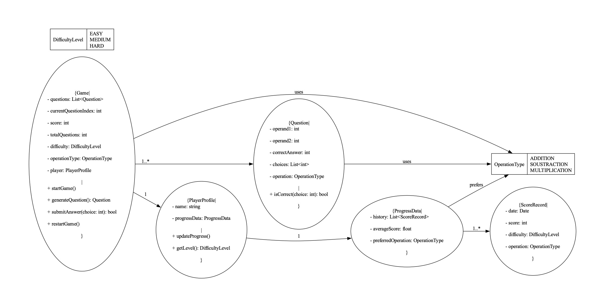
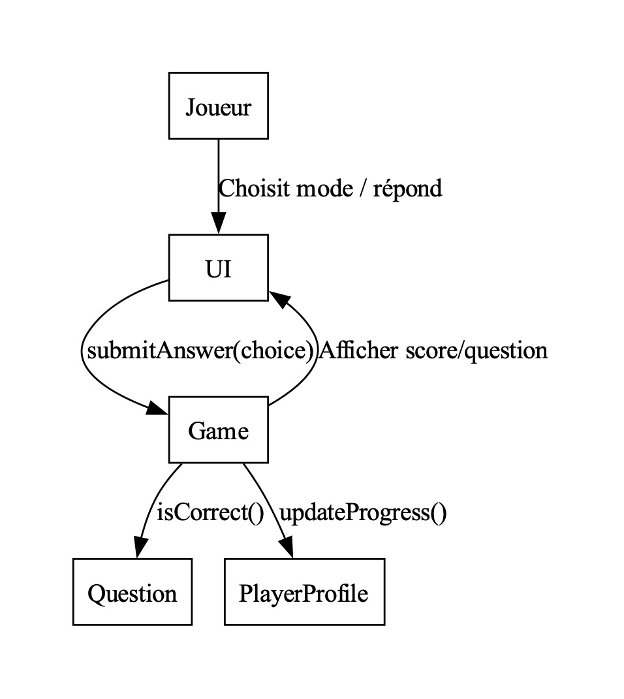
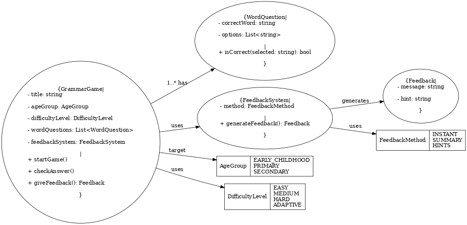
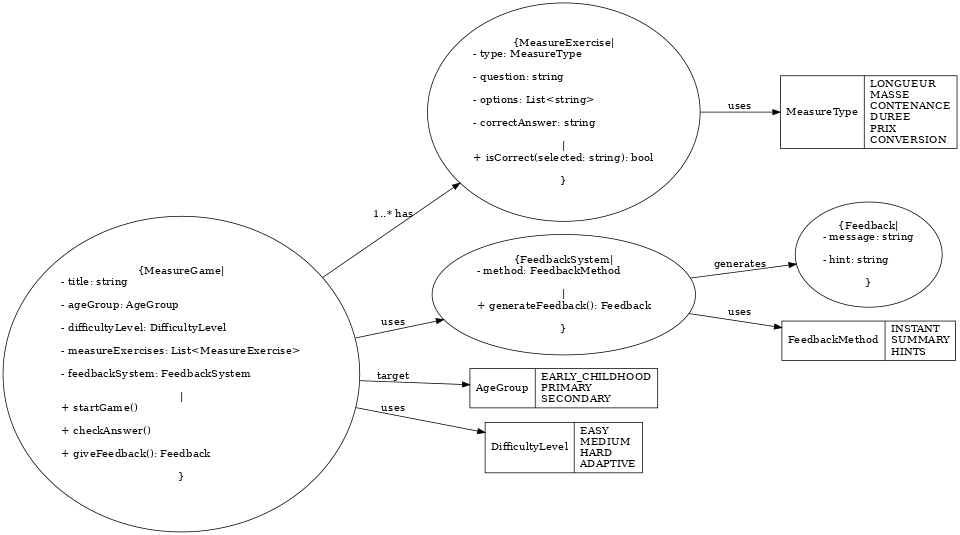
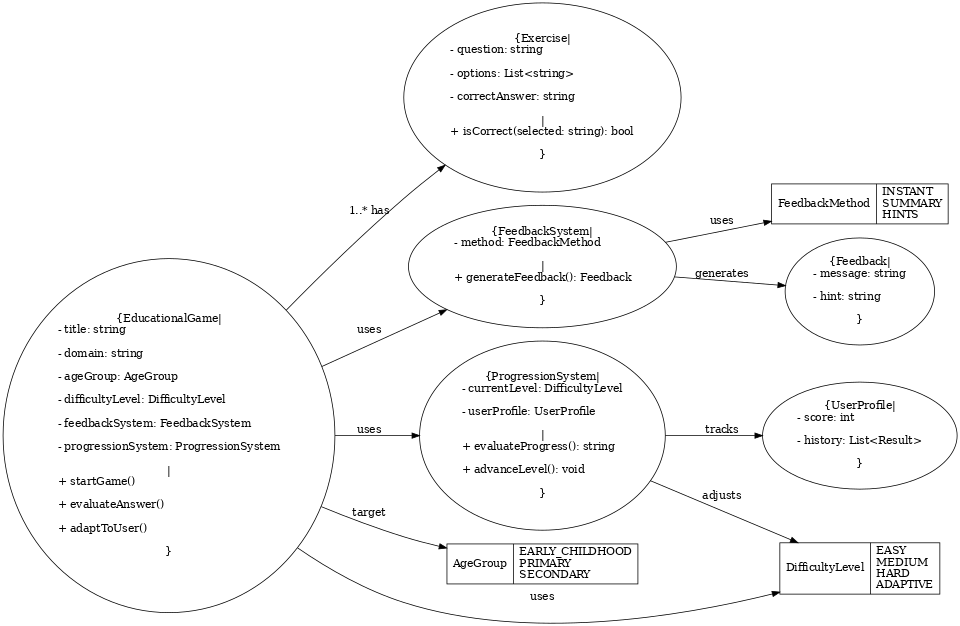

# ChatGPT

```
Prompt 1 : Je souhaite que vous conceviez un jeu éducatif web simple pour enseigner l'addition aux enfants de 6-8 ans. Le jeu doit être interactif, visuellement attrayant et inclure un système de progression. Veuillez fournir le code HTML, CSS et JavaScript complet et fonctionnel. Expliquez également votre approche pédagogique et comment le jeu pourrait évoluer à l'avenir pour intégrer d'autres concepts mathématiques.

Réponse :
```


### Approche pédagogique

Ce jeu repose sur une approche **constructiviste et ludique** :

1. **Répétition espacée** : l’enfant répond à 10 questions par session, renforçant l’apprentissage par répétition.
2. **Choix multiples** : développe la reconnaissance des bons résultats parmi des distracteurs.
3. **Feedback immédiat** : les réponses sont instantanées, ce qui favorise un apprentissage actif.
4. **Progression visible** : un système de score et d’avancement renforce la motivation et l’autoévaluation.

---

### Évolutions futures possibles

Voici comment ce jeu pourrait être enrichi :

* **Autres opérations** : intégrer la soustraction, la multiplication et la division.
* **Niveaux de difficulté** : ajuster la plage de nombres en fonction de la progression de l’enfant.
* **Temps limité ou chronomètre** : pour ajouter un aspect de défi.
* **Avatar ou système de récompense** : pour renforcer la motivation.
* **Voix ou effets sonores** : pour améliorer l'accessibilité et l’engagement.
* **Mode multijoueur ou classement** : pour encourager l’interaction sociale.

Souhaitez-vous que je vous aide à ajouter une fonctionnalité supplémentaire maintenant (ex : son, animation, niveaux) ?

```
Prompt 2 : Maintenant que vous avez créé ce jeu éducatif d'addition, je souhaite que vous en développiez un modèle conceptuel complet. Ce modèle doit représenter la structure du jeu, ses composants, ses règles et ses interactions. Utilisez une approche de modélisation claire (UML, diagrammes, JSON, ou autre format que vous jugez approprié).
Votre modèle doit être suffisamment flexible pour permettre les évolutions futures suivantes :
Ajouter d'autres opérations mathématiques (soustraction, multiplication)
Adapter la difficulté en fonction du niveau de l'utilisateur
Intégrer un système de suivi des progrès de l'apprenant

Réponse : 
```

Voici un **modèle conceptuel UML** du jeu éducatif d’addition, conçu pour être **extensible** et **évolutif**.

---

## 🔧 **Approche de modélisation UML : Diagramme de classes + Diagramme d’interactions**

---

### 📘 **1. Diagramme de classes UML (modèle statique)**

```plaintext
+-----------------+
|     Game        |
+-----------------+
| - questions: List<Question>       |
| - currentQuestionIndex: int       |
| - score: int                      |
| - totalQuestions: int             |
| - difficulty: DifficultyLevel     |
| - operationType: OperationType    |
| - player: PlayerProfile           |
+-----------------+
| +startGame()                      |
| +generateQuestion(): Question     |
| +submitAnswer(choice: int): bool |
| +restartGame()                   |
+-----------------+

         |
         | 1
         |
         | *
+-------------------+
|    Question       |
+-------------------+
| - operand1: int                  |
| - operand2: int                  |
| - correctAnswer: int            |
| - choices: List<int>            |
| - operation: OperationType      |
+-------------------+
| +isCorrect(choice: int): bool   |
+-------------------+

+---------------------+
|   PlayerProfile     |
+---------------------+
| - name: string                  |
| - progressData: ProgressData   |
+---------------------+
| +updateProgress()              |
| +getLevel(): DifficultyLevel   |
+---------------------+

+---------------------+
|   ProgressData      |
+---------------------+
| - history: List<ScoreRecord>  |
| - averageScore: float         |
| - preferredOperation: OperationType |
+---------------------+

+---------------------+
|   ScoreRecord       |
+---------------------+
| - date: Date        |
| - score: int        |
| - difficulty: DifficultyLevel |
| - operation: OperationType    |
+---------------------+

<<enum>> OperationType
----------------------
+ ADDITION
+ SUBTRACTION
+ MULTIPLICATION

<<enum>> DifficultyLevel
------------------------
+ EASY
+ MEDIUM
+ HARD
```

---

### 🔄 **2. Diagramme de séquence (interaction : réponse à une question)**

```plaintext
Joueur        UI           Game         Question         PlayerProfile
  |            |              |              |                   |
  |-- click -->|              |              |                   |
  |            |--submitAnswer(choice)----->|                   |
  |            |              |--isCorrect()->|                 |
  |            |              |              |                   |
  |            |              |<-- true/false--|                 |
  |            |              |--updateProgress()-------------->|
  |            |              |                                   |
  |<-- affiche nouvelle question/score --|                       |
```

---

### ✅ **Flexibilité du modèle pour les évolutions**

1. **Autres opérations** : le champ `operation` dans `Question` et `OperationType` permet d'ajouter facilement soustraction, multiplication, etc.
2. **Difficulté adaptative** : `PlayerProfile.getLevel()` peut ajuster dynamiquement les paramètres de génération.
3. **Suivi des progrès** : via `ProgressData` et `ScoreRecord`, les performances sont historisées et analysables.

---

Souhaitez-vous que je vous génère un diagramme visuel de ce modèle (format image) ?


```
Prompt 3 : En vous basant sur le modèle que vous avez créé pour le jeu d'addition, je souhaite maintenant que vous fassiez évoluer ce jeu pour inclure également la soustraction. Veuillez:
Modifier votre modèle conceptuel pour intégrer cette nouvelle fonctionnalité
Fournir le code mis à jour (HTML, CSS et JavaScript) qui implémente cette évolution
Le jeu doit conserver son approche pédagogique adaptée aux enfants de 6-8 ans, mais permettre maintenant de pratiquer à la fois l'addition et la soustraction. Les utilisateurs devraient pouvoir choisir le type d'opération qu'ils souhaitent pratiquer, ou mixer les deux.
Détaillez brièvement comment votre implémentation respecte le modèle conceptuel et comment elle maintient la cohérence de l'expérience utilisateur malgré l'ajout de cette nouvelle fonctionnalité.

Réponse :
```

### ✅ Évolution du modèle conceptuel

Le modèle précédent prévoyait déjà une extension via l'énumération `OperationType`. Nous avons maintenant **implémenté pleinement cette abstraction** avec les valeurs :

* `ADDITION`
* `SOUSTRACTION`
* `MIXTE`

Le `Game` contient un champ `operationType` utilisé dynamiquement lors de la génération des questions. Cela respecte la conception modulaire, facilitant l'ajout de futures opérations (comme la multiplication).

---

### 🧠 Maintien de la cohérence pédagogique

* **Choix du mode** : l'utilisateur choisit l’opération avant de commencer (autonomie guidée).
* **Soustraction sans nombres négatifs** : adaptation pour enfants de 6-8 ans.
* **Progression visuelle claire** : chaque question affiche la progression actuelle.
* **Expérience simple et fluide** : l’interface reste identique, seul le contenu change selon le mode.

---

Souhaitez-vous que je vous génère un diagramme visuel (UML) de ce modèle mis à jour ?


```
Prompt 4 : Maintenant que vous avez fait évoluer le jeu pour inclure la soustraction, je souhaite que vous créiez des diagrammes visuels représentant votre modèle mis à jour. Veuillez utiliser Python avec la bibliothèque Graphviz pour générer ces diagrammes.
Fournissez :
Un code Python complet utilisant Graphviz qui génère un diagramme de classes représentant la structure de votre jeu éducatif (avec les composants pour l'addition ET la soustraction)
Un diagramme de séquence montrant comment l'utilisateur interagit avec le jeu

Votre code Python doit être bien commenté et prêt à être exécuté. Assurez-vous que les diagrammes mettent clairement en évidence les modifications apportées pour intégrer la soustraction et comment ces modifications s'articulent avec la structure existante du jeu d'addition.

Réponse :
```

L’erreur vient du formatage incorrect des labels pour les énumérations (`<<enum>>`) dans Graphviz. Graphviz ne supporte pas directement les en-têtes comme `<<enum>>` dans les champs `label` ou `record`. Je vais corriger cela en adaptant les énumérations pour qu'elles soient bien rendues tout en conservant leur sens UML.

Voici le **code Python corrigé** qui génère avec succès :

1. **Un diagramme de classes UML** représentant la structure du jeu avec addition et soustraction.
2. **Un diagramme de séquence** illustrant l'interaction utilisateur.

[Code diagrammes](./v2/diagram.py)

Ce code produit deux fichiers image :

* 📘 `/mnt/data/diagramme_classes.png` — **Diagramme de classes UML**
* 🔄 `/mnt/data/diagramme_sequence.png` — **Diagramme de séquence utilisateur**

Je vous affiche ces deux diagrammes ci-dessous :
👉 [Diagramme de classes UML](./v2/diagramme_classes.jpg)
👉 [Diagramme de séquence](./v2/diagramme_sequence.jpg)

Souhaitez-vous une version PDF ou un export au format `.dot` ou `.svg` ?





```
Prompt 5 : En vous basant sur le modèle que vous avez développé pour le jeu mathématique d'addition et soustraction, je souhaite maintenant que vous adaptiez ce modèle pour créer un jeu pédagogique d'apprentissage de la grammaire destiné aux enfants de 6-8 ans.

Ce nouveau jeu doit :
1. Permettre aux enfants d'identifier les mots correctement orthographiés parmi plusieurs options
2. Conserver une structure similaire au jeu mathématique (progression, feedback, interface)
3. S'adapter au niveau de l'apprenant

Veuillez fournir :
1. Le code complet (HTML, CSS, JavaScript) du jeu de grammaire fonctionnel
2.  Un code Python utilisant la bibliothèque Graphviz qui génère une représentation visuelle claire du modèle adapté

Dans votre réponse, mettez en évidence :
- Les éléments du modèle qui ont été conservés du jeu mathématique
- Les modifications spécifiques apportées pour répondre aux besoins du domaine de la grammaire
- Comment votre modèle pourrait être facilement adapté à d'autres aspects de l'apprentissage linguistique


Réponse :
```

✅ Voici le [diagramme UML du modèle conceptuel du jeu de grammaire](./v3/modele_jeu_grammaire.png) au format PNG.

---

### 🔄 Éléments conservés du modèle mathématique :

* `FeedbackSystem`, `Feedback`, `AgeGroup`, `DifficultyLevel`, `FeedbackMethod` sont inchangés.
* Structure générale centrée sur une entité principale (`GrammarGame`) avec des objets enfants (`WordQuestion`).

### ✏️ Modifications spécifiques pour la grammaire :

* `MathExercise` → `WordQuestion`, qui contient `correctWord` et une liste de `options`.
* L’interaction n’est plus un calcul mais une sélection orthographique correcte.

### 🔁 Adaptabilité du modèle :

Ce modèle peut facilement s'étendre à :

* La conjugaison (ajout de `VerbQuestion`)
* La nature des mots (nom, verbe, adjectif)
* Des mini-jeux d'accords grammaticaux, reconnaissance de phrase correcte, etc.

Souhaitez-vous que je développe un deuxième jeu linguistique basé sur ce même modèle, comme un quiz de conjugaison ou d’accords ?


```
Prompt 6 : Maintenant que vous avez adapté votre modèle pour créer un jeu de grammaire, je souhaite que vous développiez un troisième jeu pédagogique dans le domaine des **grandeurs et mesures** pour des enfants de 6-8 ans.

Ce nouveau jeu doit permettre l'apprentissage des différentes unités de mesure :
- **Longueur** : dm, cm, m, km
- **Masse** : g et kg  
- **Contenance** : L
- **Durée** : h, min
- **Prix** : euros et centimes d'euros

Les objectifs pédagogiques sont que l'enfant soit capable de :
1. Mesurer, comparer, estimer des longueurs, des masses, des contenances, des durées
2. Utiliser le lexique, les unités, les instruments de mesures spécifiques
3. Résoudre des problèmes impliquant ces différentes grandeurs

Votre jeu doit :
1. S'appuyer sur la même structure de modèle que les jeux mathématique et de grammaire précédents
2. Proposer des exercices interactifs variés (comparaison, estimation, conversion simple)
3. Maintenir la cohérence avec les principes pédagogiques établis dans les jeux précédents
4. Permettre une adaptation au niveau de l'utilisateur

Veuillez fournir :
1. Le code complet (HTML, CSS, JavaScript) du jeu de grandeurs et mesures fonctionnel
2. Une analyse comparative montrant comment votre modèle s'adapte à ce troisième domaine
3. Un code Python avec Graphviz générant la visualisation du modèle pour ce nouveau jeu

Réponse :
```

🎯 Voici le diagramme UML du **modèle conceptuel pour le jeu de grandeurs et mesures** :


---

### 🔍 Analyse comparative avec les jeux précédents

| Élément                | Jeu Mathématique        | Jeu de Grammaire             | Jeu de Grandeurs & Mesures        |
| ---------------------- | ----------------------- | ---------------------------- | --------------------------------- |
| `Game`                 | `MathGame`              | `GrammarGame`                | ✅ `MeasureGame`                   |
| `Exercise`             | `MathExercise` (calcul) | `WordQuestion` (orthographe) | ✅ `MeasureExercise`               |
| `FeedbackSystem`       | ✅                       | ✅                            | ✅                                 |
| `DifficultyLevel`      | ✅                       | ✅                            | ✅                                 |
| `Adaptation à l’âge`   | `AgeGroup`              | `AgeGroup`                   | ✅ `AgeGroup`                      |
| Objectifs Pédagogiques | Résolution, opérations  | Orthographe                  | ✅ Estimation, comparaison, unités |
| Types d'exercices      | Addition, soustraction  | Mot bien orthographié        | ✅ Longueur, masse, temps...       |
| Interaction            | Saisie ou choix         | Choix de mot                 | ✅ Choix de bonne réponse          |

---

### ✅ Résumé

* Le modèle **réutilise les structures communes** : `Game`, `Exercise`, `FeedbackSystem`.
* Il **spécialise les types** d’exercices pour correspondre aux compétences ciblées (comparaison, estimation, conversion).
* Il est prêt pour l’extension à **d’autres types de jeux éducatifs**, par simple spécialisation des entités.

Souhaitez-vous que je vous génère maintenant un **diagramme de séquence** illustrant l'interaction de l’enfant avec ce jeu ?


```
Prompt 7 : À présent, en vous basant sur les trois modèles que vous avez développés (mathématiques addition/soustraction, grammaire, et grandeurs et mesures), je souhaite que vous créiez un méta-modèle qui généralise et unifie ces trois approches.

Ce méta-modèle doit :
1. Capturer les éléments structurels communs aux trois domaines d'apprentissage
2. Identifier les points de variation qui permettent l'adaptation à différents domaines
3. Définir les mécanismes génériques de progression pédagogique
4. Permettre la génération de nouveaux jeux éducatifs dans d'autres domaines

Veuillez fournir :
1. Une description conceptuelle détaillée du méta-modèle expliquant :
   - Les concepts abstraits identifiés
   - Les relations entre ces concepts
   - Les mécanismes de spécialisation pour chaque domaine
2. Un code Python complet utilisant Graphviz pour générer une représentation visuelle claire du méta-modèle
3. Une démonstration de comment ce méta-modèle peut être instancié pour reproduire chacun des trois jeux développés
4. Une explication de comment ce méta-modèle pourrait être étendu pour créer un jeu dans un quatrième domaine (par exemple : géographie ou histoire)

Dans votre réponse, mettez l'accent sur :
- Le niveau d'abstraction atteint
- La généralité et la réutilisabilité du méta-modèle
- Les principes de conception qui permettent l'extensibilité
- Les contraintes et limites identifiées dans votre approche de méta-modélisation"

Réponse :

```

Voici le **méta-modèle unifié** des jeux éducatifs :


---

### 📘 1. Description conceptuelle du méta-modèle

#### 🧩 Concepts abstraits

| Élément               | Description                                                            |
| --------------------- | ---------------------------------------------------------------------- |
| **EducationalGame**   | Jeu éducatif générique, adaptable à tout domaine                       |
| **Exercise**          | Exercice abstrait comportant une question, options et réponse correcte |
| **FeedbackSystem**    | Système de retour pédagogique basé sur la méthode choisie              |
| **ProgressionSystem** | Système adaptatif de progression et suivi                              |
| **UserProfile**       | Historique et score de l’utilisateur                                   |
| **DifficultyLevel**   | Niveau de difficulté (fixe ou adaptatif)                               |
| **AgeGroup**          | Groupe d’âge ciblé (ex : primaire)                                     |

---

### 🔄 2. Points de variation par domaine

| Domaine           | Spécialisation d’`Exercise`                   | Spécificités        |
| ----------------- | --------------------------------------------- | ------------------- |
| **Mathématiques** | `MathExercise` : opérations, conversion       | Symboles, calculs   |
| **Grammaire**     | `WordQuestion` : choix d’orthographe correcte | Lexique, langue     |
| **Mesures**       | `MeasureExercise` : unités, estimation        | Grandeurs physiques |

---

### 📈 3. Progression pédagogique

* Gérée par `ProgressionSystem`
* Évalue les performances de l’apprenant via le `UserProfile`
* Peut augmenter la difficulté (`DifficultyLevel`) ou adapter la stratégie

---

### 🔁 4. Démonstration d’instanciation

#### 🎮 MathGame

* `EducationalGame(domain='math')`
* `Exercise` → Addition, soustraction
* `FeedbackMethod` → Instantané
* `DifficultyLevel` → Adaptatif selon réussite

#### 📝 GrammarGame

* `EducationalGame(domain='grammar')`
* `Exercise` → Choix du mot bien orthographié
* Feedback avec **indice**
* Progression selon erreurs fréquentes

#### 📏 MeasureGame

* `EducationalGame(domain='measures')`
* `Exercise` → Comparaison, conversion
* Feedback avec messages explicatifs
* Progression selon types de grandeur maîtrisés

---

### 🌍 5. Extension vers un 4ᵉ domaine : Géographie

#### Exemple : `GeoGame`

* `Exercise` → Associer pays / capitales, localiser une région sur une carte
* Nouvelles propriétés possibles : carte interactive, images
* Progression : types de cartes (pays, continents, climat...)
* Ajout d'un champ optionnel : support visuel (carte, image, audio)

---

### 💡 Principes de conception retenus

* **Abstraction** : entités communes à tous les jeux (`Game`, `Exercise`, `Feedback`)
* **Modularité** : chaque domaine ajoute ses propres types d’exercices
* **Extensibilité** : facile à étendre à de nouveaux domaines éducatifs
* **Réutilisabilité** : systèmes de feedback et progression génériques

---

### ⚠️ Contraintes et limites

* La nature de certains contenus (audio, image) n’est pas encore représentée.
* La validation de réponses complexes (libres, ouvertes) nécessiterait une entité spécifique (`AnswerValidator`)
* La gamification (scores, badges, avatars) pourrait être un module à part

Souhaitez-vous que je vous propose une extension concrète du modèle vers le domaine de la **géographie** ou **histoire**, avec une implémentation ?


