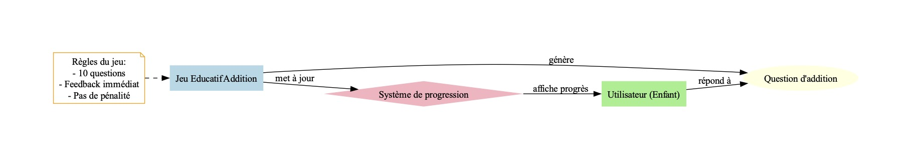
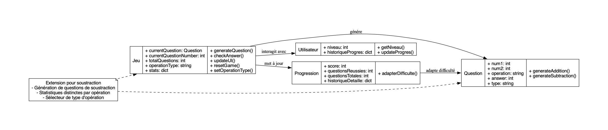
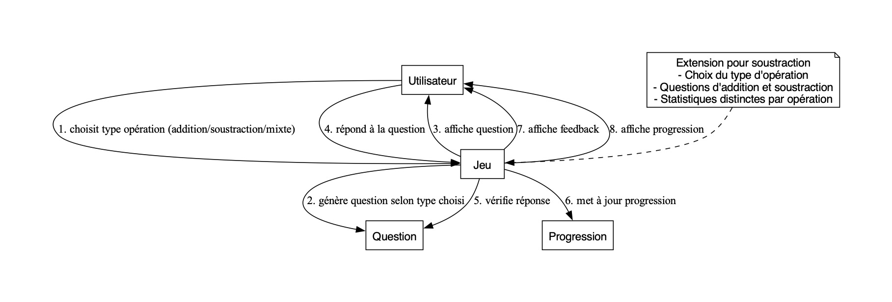
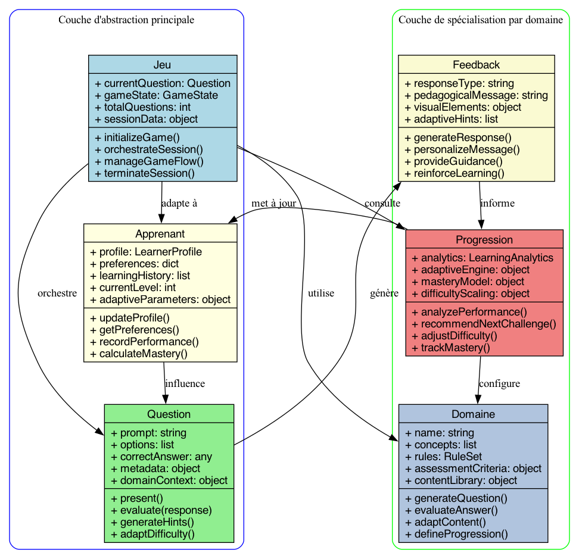

# Perplexity

```
Prompt 1 : Je souhaite que vous conceviez un jeu éducatif web simple pour enseigner l'addition aux enfants de 6-8 ans. Le jeu doit être interactif, visuellement attrayant et inclure un système de progression. Veuillez fournir le code HTML, CSS et JavaScript complet et fonctionnel. Expliquez également votre approche pédagogique et comment le jeu pourrait évoluer à l'avenir pour intégrer d'autres concepts mathématiques.

Réponse :
```

Voici un jeu d'addition interactif pour les enfants de 6-8 ans qui répond à votre demande :

Le code HTML, CSS et JavaScript fourni crée un jeu d'addition simple mais efficace avec les caractéristiques suivantes :

- Interface colorée et attrayante avec une police ludique (Comic Sans MS)
- Questions d'addition générées aléatoirement avec des nombres de 0 à 9
- Système de progression sur 10 questions
- Retour immédiat sur les réponses (feedback positif en vert, négatif en rouge)
- Design adapté aux enfants avec des couleurs vives et des éléments arrondis

**Approche pédagogique**

Ce jeu utilise plusieurs principes pédagogiques efficaces pour l'apprentissage des mathématiques chez les jeunes enfants :

- Renforcement positif immédiat ("Bravo ! Bonne réponse")
- Encouragement à réessayer en cas d'erreur sans pénalité
- Progression claire avec suivi du nombre de questions
- Interface simple et intuitive pour maintenir la concentration sur l'apprentissage
- Utilisation de nombres adaptés à l'âge cible (0-9)

**Évolutions futures possibles**

Le jeu pourrait être amélioré pour intégrer d'autres concepts mathématiques :

- Ajout de niveaux de difficulté (nombres plus grands, soustractions, multiplications)
- Intégration d'éléments visuels comme des objets à compter
- Système de points et de récompenses
- Minuteur optionnel pour développer la rapidité de calcul
- Mode multijoueur pour encourager l'apprentissage collaboratif
- Statistiques de progression pour suivre l'évolution de l'enfant

Ce jeu constitue une base solide qui peut facilement être étendue pour couvrir un programme mathématique plus complet tout en maintenant son aspect ludique et engageant.

Souhaitez-vous des modifications spécifiques à ce jeu ou des détails sur l'une des évolutions proposées ?

```
Prompt 2 : Maintenant que vous avez créé ce jeu éducatif d'addition, je souhaite que vous en développiez un modèle conceptuel complet. Ce modèle doit représenter la structure du jeu, ses composants, ses règles et ses interactions. Utilisez une approche de modélisation claire (UML, diagrammes).
Votre modèle doit être suffisamment flexible pour permettre les évolutions futures suivantes :
Ajouter d'autres opérations mathématiques (soustraction, multiplication)
Adapter la difficulté en fonction du niveau de l'utilisateur
Intégrer un système de suivi des progrès de l'apprenant

Réponse : 
```

# Modèle conceptuel du jeu éducatif d'addition

Voici un modèle conceptuel complet pour le jeu éducatif d'addition, conçu pour être flexible et extensible.

## Composants principaux

**Jeu**
- Composant central qui gère la logique globale
- Responsable de la génération des questions
- Vérifie les réponses et met à jour la progression
- Adapte la difficulté selon le niveau de l'utilisateur

**Question**
- Représente une question mathématique spécifique
- Contient l'opération (addition, soustraction, multiplication)
- Niveau de difficulté ajustable
- Stocke l'énoncé et la réponse attendue

**Utilisateur**
- Représente l'enfant qui utilise le jeu
- Stocke les informations sur son niveau actuel
- Conserve l'historique de ses progrès

**Progression**
- Suit le score et les performances de l'utilisateur
- Enregistre les questions réussies et totales
- Maintient un historique détaillé pour analyse
- Permet d'adapter la difficulté automatiquement

## Interactions entre composants

- Le Jeu génère des Questions adaptées au niveau de l'Utilisateur
- L'Utilisateur répond aux Questions présentées
- Le Jeu vérifie les réponses et met à jour la Progression
- La Progression influence le niveau de difficulté des futures Questions
- Le système fournit un feedback immédiat à l'Utilisateur

## Règles du jeu

- Session standard de 10 questions (paramètre modifiable)
- Feedback immédiat après chaque réponse
- Pas de pénalité pour les erreurs, encouragement à réessayer
- Difficulté adaptative basée sur les performances
- Suivi détaillé des progrès pour visualiser l'évolution

## Extensibilité du modèle

Ce modèle est conçu pour permettre facilement:

1. L'ajout de nouvelles opérations mathématiques (soustraction, multiplication) en étendant simplement les types d'opérations dans la classe Question

2. L'adaptation de la difficulté grâce au système de niveau intégré dans les classes Utilisateur et Question

3. Le suivi détaillé des progrès via la classe Progression qui maintient l'historique complet des performances

Cette architecture modulaire permet d'ajouter de nouvelles fonctionnalités sans modifier la structure fondamentale du jeu, assurant ainsi sa pérennité et son évolutivité.

Souhaitez-vous des précisions sur un aspect particulier de ce modèle conceptuel ou sur la façon d'implémenter une des extensions proposées?



```
Prompt 3 : En vous basant sur le modèle que vous avez créé pour le jeu d'addition, je souhaite maintenant que vous fassiez évoluer ce jeu pour inclure également la soustraction. Veuillez:
Modifier votre modèle conceptuel pour intégrer cette nouvelle fonctionnalité
Fournir le code mis à jour (HTML, CSS et JavaScript) qui implémente cette évolution
Le jeu doit conserver son approche pédagogique adaptée aux enfants de 6-8 ans, mais permettre maintenant de pratiquer à la fois l'addition et la soustraction. Les utilisateurs devraient pouvoir choisir le type d'opération qu'ils souhaitent pratiquer, ou mixer les deux.
Détaillez brièvement comment votre implémentation respecte le modèle conceptuel et comment elle maintient la cohérence de l'expérience utilisateur malgré l'ajout de cette nouvelle fonctionnalité.

Réponse :
```
# Évolution du jeu éducatif pour inclure la soustraction

## Modèle conceptuel mis à jour

Le modèle conceptuel a été étendu pour intégrer la soustraction:

- **Jeu**: Ajout d'un sélecteur de type d'opération (addition, soustraction, mixte)
- **Question**: Extension pour générer des questions de soustraction adaptées au niveau
- **Utilisateur**: Suivi des performances par type d'opération
- **Progression**: Statistiques distinctes pour chaque type d'opération

Cette évolution préserve la structure modulaire tout en ajoutant la flexibilité nécessaire pour gérer différentes opérations mathématiques.

## Code complet mis à jour

Voir [Code](./v2/index.html)

## Respect du modèle conceptuel et cohérence de l'expérience utilisateur

### Respect du modèle conceptuel

1. **Modularité préservée**: La classe `MathGame` encapsule toute la logique du jeu, respectant le modèle conceptuel initial.

2. **Extension des questions**: Le système de génération de questions a été étendu pour créer des soustractions adaptées au niveau des enfants (résultats toujours positifs).

3. **Statistiques distinctes**: Le suivi des performances est maintenu séparément pour chaque type d'opération, conformément au modèle de progression.

4. **Sélection d'opération**: L'interface permet de choisir le type d'exercice souhaité (addition, soustraction ou mixte), comme prévu dans le modèle étendu.

### Cohérence de l'expérience utilisateur

1. **Interface unifiée**: L'ajout de la soustraction s'intègre harmonieusement dans l'interface existante, avec un code couleur cohérent (bleu pour addition, orange pour soustraction).

2. **Feedback adapté**: Le système de feedback reste identique pour les deux types d'opérations, maintenant une expérience cohérente.

3. **Progression claire**: Le suivi de progression reste simple et compréhensible malgré l'ajout d'une nouvelle opération.

4. **Difficulté adaptée**: Les soustractions sont générées de manière à toujours avoir des résultats positifs, adaptés aux enfants de 6-8 ans.

5. **Statistiques visuelles**: L'ajout d'un tableau de bord simple permet à l'enfant de visualiser ses performances par type d'opération.

Cette implémentation respecte l'approche pédagogique initiale tout en étendant les fonctionnalités du jeu, démontrant la flexibilité du modèle conceptuel pour intégrer de nouvelles opérations mathématiques.


```
Prompt 4 : Maintenant que vous avez fait évoluer le jeu pour inclure la soustraction, je souhaite que vous créiez des diagrammes visuels représentant votre modèle mis à jour. Veuillez utiliser Python avec la bibliothèque Graphviz pour générer ces diagrammes.
Fournissez :
Un code Python complet utilisant Graphviz qui génère un diagramme de classes représentant la structure de votre jeu éducatif (avec les composants pour l'addition ET la soustraction)
Un diagramme de séquence montrant comment l'utilisateur interagit avec le jeu

Votre code Python doit être bien commenté et prêt à être exécuté. Assurez-vous que les diagrammes mettent clairement en évidence les modifications apportées pour intégrer la soustraction et comment ces modifications s'articulent avec la structure existante du jeu d'addition.

Réponse :
```


## Explication des diagrammes

### Diagramme de classes

Le diagramme de classes représente la structure du jeu éducatif avec les quatre composants principaux:

1. **Jeu**: La classe centrale qui gère toute la logique du jeu. Les modifications pour la soustraction incluent:
    - Ajout de l'attribut `operationType` pour stocker le type d'opération choisi
    - Ajout de la méthode `setOperationType()` pour changer entre addition, soustraction et mode mixte
    - Extension des statistiques pour suivre les performances par type d'opération

2. **Question**: Représente une question mathématique. Les modifications incluent:
    - Ajout de l'attribut `type` pour distinguer les questions d'addition et de soustraction
    - Ajout de la méthode `generateSubtraction()` pour créer des questions de soustraction adaptées

3. **Utilisateur**: Représente l'enfant qui utilise le jeu, avec son niveau et son historique.

4. **Progression**: Suit les performances de l'utilisateur, maintenant avec des statistiques distinctes par type d'opération.

Une note spéciale met en évidence les extensions apportées pour intégrer la soustraction, montrant comment ces modifications s'articulent avec la structure existante.

### Diagramme de séquence

Le diagramme de séquence montre l'interaction entre l'utilisateur et le jeu, avec une attention particulière aux étapes suivantes:

1. L'utilisateur choisit d'abord le type d'opération (addition, soustraction ou mixte)
2. Le jeu génère une question appropriée selon le type choisi
3. Le jeu affiche la question à l'utilisateur
4. L'utilisateur répond à la question
5. Le jeu vérifie la réponse
6. Le jeu met à jour la progression avec des statistiques distinctes par type d'opération
7. Le jeu fournit un feedback à l'utilisateur
8. Le jeu affiche la progression mise à jour

Une note spéciale met en évidence les modifications apportées pour intégrer la soustraction dans le flux d'interaction.

Ces diagrammes illustrent clairement comment l'ajout de la soustraction s'intègre harmonieusement dans l'architecture existante du jeu, tout en préservant sa cohérence et en facilitant son évolution future.




```
Prompt 5 : En vous basant sur le modèle que vous avez développé pour le jeu mathématique d'addition et soustraction, je souhaite maintenant que vous adaptiez ce modèle pour créer un jeu pédagogique d'apprentissage de la grammaire destiné aux enfants de 6-8 ans.

Ce nouveau jeu doit :
1. Permettre aux enfants d'identifier les mots correctement orthographiés parmi plusieurs options
2. Conserver une structure similaire au jeu mathématique (progression, feedback, interface)
3. S'adapter au niveau de l'apprenant

Veuillez fournir :
1. Le code complet (HTML, CSS, JavaScript) du jeu de grammaire fonctionnel
2.  Un code Python utilisant la bibliothèque Graphviz qui génère une représentation visuelle claire du modèle adapté

Dans votre réponse, mettez en évidence :
- Les éléments du modèle qui ont été conservés du jeu mathématique
- Les modifications spécifiques apportées pour répondre aux besoins du domaine de la grammaire
- Comment votre modèle pourrait être facilement adapté à d'autres aspects de l'apprentissage linguistique


Réponse :
```
# Adaptation du jeu mathématique en jeu de grammaire

En adaptant le modèle du jeu mathématique d'addition et soustraction, j'ai créé un jeu pédagogique d'apprentissage de la grammaire qui conserve la structure fondamentale tout en l'adaptant aux spécificités de l'apprentissage linguistique.

## Code complet du jeu de grammaire

-  Voir [Code](./v3/index.html)

## Code Python pour générer le modèle avec Graphviz

-  Voir [Code](./v3/modele.py)

## Éléments conservés du jeu mathématique

1. **Structure générale du modèle**:
   - La classe `Jeu` qui gère la logique globale
   - Le système de progression avec suivi du score
   - Le mécanisme de feedback immédiat
   - L'interface utilisateur intuitive avec des boutons colorés

2. **Composants principaux**:
   - Système de questions séquentielles
   - Vérification des réponses
   - Feedback visuel (couleurs verte/rouge)
   - Progression sur un nombre défini de questions
   - Interface adaptée aux enfants

3. **Mécanismes d'interaction**:
   - Sélection d'options par clic
   - Feedback immédiat après chaque réponse
   - Navigation entre questions
   - Affichage du score final

## Modifications spécifiques pour la grammaire

1. **Contenu des questions**:
   - Remplacement des opérations mathématiques par des mots à orthographier correctement
   - Adaptation du format des options (mots au lieu de nombres)

2. **Présentation visuelle**:
   - Palette de couleurs adaptée au domaine linguistique (violet au lieu de bleu)
   - Disposition des options sous forme de boutons horizontaux

3. **Structure des données**:
   - Modification de la structure des questions pour contenir un mot correct et des variantes incorrectes
   - Adaptation du système de vérification pour comparer des chaînes de caractères

4. **Modèle conceptuel**:
   - Ajout d'une classe spécialisée `OrthographeQuestion` qui étend la classe `Question` générique
   - Adaptation des méthodes pour gérer des mots plutôt que des opérations mathématiques

## Adaptabilité à d'autres aspects linguistiques

Ce modèle peut facilement être adapté à d'autres aspects de l'apprentissage linguistique:

1. **Conjugaison de verbes**:
   - Modification de la structure des questions pour présenter un verbe à l'infinitif
   - Options présentant différentes conjugaisons possibles
   - Ajout d'une classe spécialisée `ConjugaisonQuestion`

2. **Grammaire et syntaxe**:
   - Adaptation pour présenter des phrases avec différentes structures grammaticales
   - Options présentant des variations syntaxiques
   - Ajout d'une classe `SyntaxeQuestion`

3. **Vocabulaire et définitions**:
   - Modification pour présenter un mot et demander sa définition
   - Options présentant différentes définitions possibles
   - Ajout d'une classe `VocabulaireQuestion`

4. **Reconnaissance de phonèmes**:
   - Adaptation pour l'apprentissage des sons et de la phonétique
   - Options présentant des mots avec des sons similaires
   - Ajout d'une classe `PhonemeQuestion`

La force de ce modèle réside dans sa modularité. En conservant la structure fondamentale du jeu et en spécialisant uniquement les composants nécessaires, il devient possible de créer rapidement une famille de jeux éducatifs couvrant différents aspects de l'apprentissage linguistique tout en maintenant une expérience utilisateur cohérente et engageante pour les jeunes apprenants.

```
Prompt 6 : Maintenant que vous avez adapté votre modèle pour créer un jeu de grammaire, je souhaite que vous développiez un troisième jeu pédagogique dans le domaine des **grandeurs et mesures** pour des enfants de 6-8 ans.

Ce nouveau jeu doit permettre l'apprentissage des différentes unités de mesure :
- **Longueur** : dm, cm, m, km
- **Masse** : g et kg  
- **Contenance** : L
- **Durée** : h, min
- **Prix** : euros et centimes d'euros

Les objectifs pédagogiques sont que l'enfant soit capable de :
1. Mesurer, comparer, estimer des longueurs, des masses, des contenances, des durées
2. Utiliser le lexique, les unités, les instruments de mesures spécifiques
3. Résoudre des problèmes impliquant ces différentes grandeurs

Votre jeu doit :
1. S'appuyer sur la même structure de modèle que les jeux mathématique et de grammaire précédents
2. Proposer des exercices interactifs variés (comparaison, estimation, conversion simple)
3. Maintenir la cohérence avec les principes pédagogiques établis dans les jeux précédents
4. Permettre une adaptation au niveau de l'utilisateur

Veuillez fournir :
1. Le code complet (HTML, CSS, JavaScript) du jeu de grandeurs et mesures fonctionnel
2. Une analyse comparative montrant comment votre modèle s'adapte à ce troisième domaine
3. Un code Python avec Graphviz générant la visualisation du modèle pour ce nouveau jeu

```

# Jeu pédagogique des grandeurs et mesures

En adaptant le modèle établi pour les jeux mathématique et de grammaire, j'ai développé un jeu interactif d'apprentissage des grandeurs et mesures qui conserve la structure fondamentale tout en l'adaptant aux spécificités de ce domaine.

## Code complet du jeu de grandeurs et mesures

- Voir [Code](./v4/index.html)

## Analyse comparative : adaptation du modèle aux trois domaines

### Éléments conservés dans les trois jeux

1. **Structure fondamentale**:
   - Classe principale de gestion du jeu
   - Système de progression séquentielle
   - Mécanisme de feedback immédiat
   - Interface utilisateur cohérente

2. **Composants du modèle**:
   - Génération de questions adaptées
   - Vérification des réponses
   - Suivi du score et de la progression
   - Adaptation au niveau de l'utilisateur

3. **Principes pédagogiques**:
   - Feedback positif et encourageant
   - Progression adaptée à l'âge (6-8 ans)
   - Interface colorée et attrayante
   - Mécanisme de renforcement positif

### Adaptations spécifiques au domaine des grandeurs et mesures

1. **Structure des données**:
   - **Mathématiques** : Opérations numériques simples
   - **Grammaire** : Mots et orthographe
   - **Mesures** : Valeurs avec unités et conversions

2. **Types d'exercices**:
   - **Mathématiques** : Addition/soustraction
   - **Grammaire** : Choix orthographique
   - **Mesures** : Comparaison, estimation, conversion

3. **Complexité cognitive**:
   - **Mathématiques** : Calcul mental
   - **Grammaire** : Reconnaissance visuelle
   - **Mesures** : Raisonnement spatial et proportionnel

4. **Éléments visuels**:
   - **Mathématiques** : Nombres et symboles
   - **Grammaire** : Mots et texte
   - **Mesures** : Objets concrets et unités

## Code Python pour la visualisation du modèle

[Voir le code](./v4/modele.py)


## Synthèse de l'adaptation du modèle

Le jeu de grandeurs et mesures démontre la flexibilité du modèle de base en introduisant :

1. **Complexité conceptuelle accrue** : Gestion de 5 types de grandeurs avec leurs unités spécifiques
2. **Variété d'exercices** : 3 types d'activités (comparaison, estimation, conversion)
3. **Réalisme pédagogique** : Estimations basées sur des objets familiers aux enfants
4. **Progression adaptative** : Niveau ajusté selon les performances

Cette adaptation maintient la cohérence pédagogique tout en enrichissant l'expérience d'apprentissage, confirmant la robustesse et l'extensibilité du modèle conceptuel développé.

```
Prompt 7 : À présent, en vous basant sur les trois modèles que vous avez développés (mathématiques addition/soustraction, grammaire, et grandeurs et mesures), je souhaite que vous créiez un méta-modèle qui généralise et unifie ces trois approches.

Ce méta-modèle doit :
1. Capturer les éléments structurels communs aux trois domaines d'apprentissage
2. Identifier les points de variation qui permettent l'adaptation à différents domaines
3. Définir les mécanismes génériques de progression pédagogique
4. Permettre la génération de nouveaux jeux éducatifs dans d'autres domaines

Veuillez fournir :
1. Une description conceptuelle détaillée du méta-modèle expliquant :
   - Les concepts abstraits identifiés
   - Les relations entre ces concepts
   - Les mécanismes de spécialisation pour chaque domaine
2. Un code Python complet utilisant Graphviz pour générer une représentation visuelle claire du méta-modèle
3. Une démonstration de comment ce méta-modèle peut être instancié pour reproduire chacun des trois jeux développés
4. Une explication de comment ce méta-modèle pourrait être étendu pour créer un jeu dans un quatrième domaine (par exemple : géographie ou histoire)

Dans votre réponse, mettez l'accent sur :
- Le niveau d'abstraction atteint
- La généralité et la réutilisabilité du méta-modèle
- Les principes de conception qui permettent l'extensibilité
- Les contraintes et limites identifiées dans votre approche de méta-modélisation"

Réponse :

```


# Méta-modèle unifié pour les jeux éducatifs

En analysant les trois jeux développés (mathématiques, grammaire, grandeurs et mesures), j'ai identifié les patterns communs et créé un méta-modèle unifié qui capture l'essence des jeux éducatifs tout en permettant une spécialisation flexible selon les domaines.

## Description conceptuelle détaillée du méta-modèle

### Concepts abstraits identifiés

Le méta-modèle s'articule autour de six concepts fondamentaux qui forment l'architecture commune de tout jeu éducatif :

**1. Jeu (Game Engine)**
Le composant central qui orchestre l'expérience d'apprentissage. Il maintient l'état global du jeu, gère la séquence des questions et coordonne les interactions entre tous les autres composants. Sa responsabilité principale est de fournir une expérience cohérente indépendamment du domaine d'apprentissage.

**2. Question (Learning Challenge)**
L'unité atomique d'apprentissage qui encapsule un défi pédagogique. Elle contient les données spécifiques au domaine tout en exposant une interface standardisée pour la présentation et l'évaluation. Cette abstraction permet de traiter uniformément des concepts aussi différents que les opérations mathématiques, l'orthographe ou les mesures.

**3. Domaine (Subject Domain)**
Le point de variation principal qui encapsule les règles, concepts et mécanismes spécifiques à chaque discipline. Il agit comme une factory pour générer des questions adaptées et définit les critères d'évaluation propres au domaine.

**4. Apprenant (Learner)**
La représentation de l'utilisateur avec son profil d'apprentissage, ses préférences et son historique de progression. Ce composant permet l'adaptation personnalisée de l'expérience éducative.

**5. Progression (Learning Analytics)**
Le système qui analyse les performances, adapte la difficulté et guide le parcours d'apprentissage. Il implémente les algorithmes pédagogiques qui déterminent la séquence optimale des défis.

**6. Feedback (Educational Response)**
Le mécanisme de retour qui fournit des réponses adaptées aux actions de l'apprenant. Il traduit les résultats bruts en messages pédagogiquement pertinents selon le contexte du domaine.

### Relations entre les concepts

Les relations entre ces concepts forment un réseau cohérent qui garantit la fluidité de l'expérience d'apprentissage :

- **Orchestration** : Le Jeu coordonne tous les autres composants
- **Spécialisation** : Le Domaine configure la Question selon ses règles spécifiques
- **Personnalisation** : L'Apprenant influence la Progression qui adapte les Questions
- **Évaluation** : La Question génère un Feedback qui informe la Progression
- **Adaptation** : La Progression modifie les paramètres du Domaine pour ajuster la difficulté

### Mécanismes de spécialisation

Chaque domaine spécialise le méta-modèle selon trois axes principaux :

**1. Structure des données** : Format des questions, types de réponses, critères d'évaluation
**2. Logique métier** : Règles de génération, algorithmes de vérification, mécanismes de progression
**3. Présentation** : Interface utilisateur, éléments visuels, modalités d'interaction

## Code Python pour la représentation visuelle

-  Voir [Code](./meta/global-modele/meta.py)


## Démonstration des instanciations

### Reproduction du jeu mathématique

```python
class JeuMathematiques(Jeu):
    def __init__(self):
        domaine = DomaineMatematiques()
        domaine.operations = ['addition', 'soustraction']
        domaine.numberRange = range(0, 10)
        super().__init__(domaine)
    
    def generer_question_specifique(self):
        return self.domaine.generateArithmeticQuestion()
```

### Reproduction du jeu de grammaire

```python
class JeuGrammaire(Jeu):
    def __init__(self):
        domaine = DomaineGrammaire()
        domaine.wordLibrary = self.charger_dictionnaire()
        domaine.difficultyByLength = {1: 3, 2: 5, 3: 7}
        super().__init__(domaine)
    
    def generer_question_specifique(self):
        return self.domaine.generateOrthographyQuestion()
```

### Reproduction du jeu de mesures

```python
class JeuMesures(Jeu):
    def __init__(self):
        domaine = DomaineMesures()
        domaine.measurementTypes = ['longueur', 'masse', 'contenance']
        domaine.units = self.charger_unites()
        super().__init__(domaine)
    
    def generer_question_specifique(self):
        return self.domaine.generateMeasurementQuestion()
```

## Extension vers un quatrième domaine : Géographie

Pour démontrer l'extensibilité du méta-modèle, voici comment créer un jeu de géographie :

```python
class DomaineGeographie(Domaine):
    def __init__(self):
        super().__init__()
        self.countries = self.charger_pays()
        self.capitals = self.charger_capitales()
        self.continents = self.charger_continents()
        self.geographicalFeatures = self.charger_caracteristiques()
    
    def generateLocationQuestion(self):
        question_types = ['capital', 'continent', 'voisin', 'caracteristique']
        question_type = random.choice(question_types)
        
        if question_type == 'capital':
            pays = random.choice(self.countries)
            return QuestionCapitale(pays, self.capitals[pays])
        elif question_type == 'continent':
            pays = random.choice(self.countries)
            return QuestionContinent(pays, self.continents[pays])
        # ... autres types de questions
    
    def evaluateGeographicalAnswer(self, question, response):
        return question.correctAnswer.lower() == response.lower()
    
    def adaptGeographicalScope(self, performance):
        if performance > 0.8:
            self.countries.extend(self.pays_avances)
        elif performance < 0.5:
            self.countries = self.pays_faciles
```

## Niveau d'abstraction et principes de conception

### Niveau d'abstraction atteint

Le méta-modèle opère à trois niveaux d'abstraction :

1. **Niveau conceptuel** : Définit les concepts universels (Jeu, Question, Domaine)
2. **Niveau architectural** : Spécifie les relations et interactions entre composants
3. **Niveau opérationnel** : Fournit les mécanismes concrets d'instanciation

### Généralité et réutilisabilité

La généralité du méta-modèle repose sur :

- **Séparation des préoccupations** : Chaque composant a une responsabilité claire
- **Inversion de dépendance** : Les abstractions ne dépendent pas des détails
- **Composition sur héritage** : Favorise la flexibilité et la réutilisabilité
- **Interfaces stables** : Permettent l'évolution indépendante des composants

### Principes de conception pour l'extensibilité

1. **Open/Closed Principle** : Ouvert à l'extension, fermé à la modification
2. **Strategy Pattern** : Permet de changer d'algorithme selon le domaine
3. **Factory Pattern** : Encapsule la création d'objets spécifiques au domaine
4. **Observer Pattern** : Facilite la communication entre composants

### Contraintes et limites identifiées

**Contraintes assumées :**
- Interaction basée sur des questions-réponses
- Progression linéaire avec feedback immédiat
- Interface utilisateur similaire entre domaines
- Évaluation binaire (correct/incorrect) principalement

**Limites du modèle :**
- Difficulté à modéliser des apprentissages très collaboratifs
- Adaptation limitée aux domaines nécessitant des interactions complexes
- Progression adaptative basée sur des heuristiques simples
- Interface utilisateur contrainte par le modèle unifié

**Extensions possibles :**
- Support de l'apprentissage collaboratif
- Intégration de l'intelligence artificielle pour l'adaptation
- Modèles de progression plus sophistiqués
- Interfaces utilisateur plus diversifiées

Ce méta-modèle unifié constitue une base solide pour le développement rapide de jeux éducatifs tout en maintenant une cohérence pédagogique et technique. Sa force réside dans l'équilibre entre généralité et spécificité, permettant une adaptation flexible aux besoins de différents domaines d'apprentissage.


